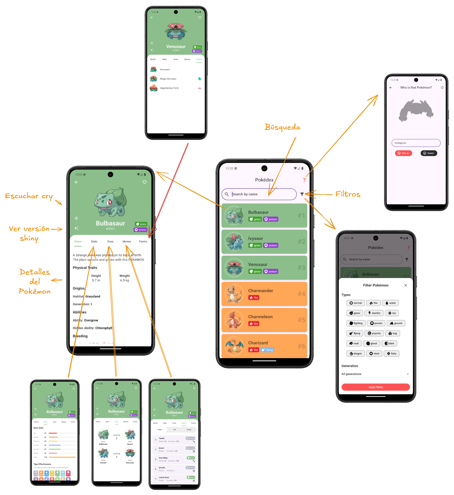

# Pokédex App

## Descripción del Proyecto

Esta aplicación de Pokédex brinda a los entusiastas de Pokémon una experiencia interactiva y detallada, proporcionando información exhaustiva sobre diversas especies a través de consultas GraphQL a la PokéAPI, lo que garantiza eficiencia y rapidez en la obtención de datos. Los usuarios pueden explorar estadísticas, habilidades y particularidades específicas de cada Pokémon, como tipos, peso, altura y evolución, en una plataforma integral que facilita el acceso a información precisa y detallada sobre el universo Pokémon.

## Funcionalidades Principales

- **Pantalla de lista de Pokémon**: una vista de desplazamiento con imágenes y nombres de Pokémon.
- **Pantalla de detalles del Pokémon**: muestra información detallada, incluidas estadísticas, tipo, peso y altura.
- **Estadísticas de combate**: desglose de los valores de HP, ataque, defensa, velocidad, etc.
- **Búsqueda Avanzada**: encuentra rápidamente Pokémon específicos utilizando la función de búsqueda por nombre, facilitando el acceso directo a la información deseada.

## Tecnologías Utilizadas

- **Flutter**
- **GraphQL**
- **PokéAPI**

## Configuración e Instalación

1. Clonar el repositorio:
```bash
git clone https://github.com/leandro-0/pokedex.git
cd pokedex
```
   
2. Instalar dependencias de Flutter:
```bash
flutter pub get
```

3. Generar entidades de ObjectBox:
```bash
dart run build_runner build
```

4. Ejecutar la aplicación:
```bash
flutter run
```

## Uso de la API GraphQL

La aplicación utiliza diversas consultas GraphQL para interactuar de manera eficiente con la PokéAPI y obtener información detallada sobre los Pokémon. De forma detallada, se realizan *queries* específicos para:

- **Lista de Pokémon**: se cargan datos esenciales para solo visualizarlos en la lista, como: nombre, tipos, ID y sprites. Asimismo, se incluyen los filtros en esa misma consulta.

- **Who is that Pokémon?**: se hace una consulta para solo obtener la información para mostrar una pista al usuario de cuál es ese Pokémon y la necesaria para pasar a la pantalla de detalles cuando lo adivine o se rinda.

- **Grito del Pokémon**: se realiza una consulta específicamente para ese único audio.

- **Detalles (about)**: se hace una consulta para obtener datos como: egg group, descripción, hábitat, peso, altura, porcentaje de género, habilidades, etc.

- **Movimientos**: se hace un query que traiga todos los movimientos y luego estos se clasifican en diferentes categorías.

- **Evoluciones**: se usa este query para obtener la cadena evolutiva de un Pokémon y los métodos de evolución que necesita.

- **Base stats**: una consulta para traer las estadísticas bases de un Pokémon.

- **Formas de un Pokémon**

A continuación se presenta un ejemplo de una las utilizadas para obtener las formas posibles de un Pokémon en base a su ID en la Pokédex Nacional. En esta se incluye: nombre de la forma, sprites, si es una mega evolución, el orden de la forma y su nombre en inglés.

```graphql
query GetPokemonForms($id: Int) {
  pokemon_v2_pokemon(where: {id: {_eq: $id}}) {
    pokemon_v2_pokemonspecy {
      pokemon_v2_pokemons {
        pokemon_v2_pokemonforms(order_by: {form_order: asc}) {
          pokemon_v2_pokemonformsprites {
            sprites(path: "front_default")
          }
          name
          form_order
          is_mega
          pokemon_v2_pokemonformnames(where: {language_id: {_eq: 9}}) {
            name
          }
        }
      }
    }
  }
}
```

## Decisiones de Diseño
## Componentes de Flutter:

La aplicación Pokédex está compuesta por varias pantallas clave, cada una diseñada cuidadosamente utilizando componentes de Flutter para ofrecer una experiencia de usuario intuitiva y atractiva. A continuación se detallan todas las pantallas y los componentes utilizados:

# Pokédex App

## 1. Pantalla de Lista de Pokémon
**Descripción**: Presenta una lista desplazable de Pokémon con sus imágenes y nombres, permitiendo al usuario explorar y seleccionar un Pokémon para ver más detalles.

**Componentes Utilizados**:
- `Scaffold`: Estructura básica de la pantalla.
- `AppBar`: Barra superior con el título y opciones de navegación.
- `GridView.builder`: Crea una cuadrícula desplazable que muestra los Pokémon en un formato de tarjetas.
- `Card`: Envuelve cada elemento de la cuadrícula para darles un aspecto de tarjeta.
- `FutureBuilder`: Maneja y muestra datos asincrónicos obtenidos de la API.

## 2. Pantalla de Detalles del Pokémon
**Descripción**: Muestra información detallada del Pokémon seleccionado, incluyendo su imagen, tipos, estadísticas, habilidades y movimientos.

**Componentes Utilizados**:
- `Scaffold` con `AppBar` personalizado: Incluye el nombre del Pokémon y un botón de regreso.
- `SingleChildScrollView`: Permite el desplazamiento vertical del contenido cuando excede la pantalla.
- `Column`: Organiza los elementos principales verticalmente.
- `Row` y `Wrap`: Distribuyen elementos horizontalmente y se ajustan automáticamente al espacio disponible.
- `Image`: Muestra la imagen del Pokémon.
- `Chip`: Representa visualmente los tipos y habilidades con etiquetas estilizadas.
- `TabBar` y `TabBarView`: Implementa pestañas para navegar entre secciones como "Estadísticas", "Movimientos" y "Evolución".
- `StatBar` (Widget Personalizado): Visualiza las estadísticas del Pokémon con barras de progreso y colores representativos.
- `CircularProgressIndicator`: Indica la carga de datos mientras se esperan las respuestas de la API.

## 3. Pantalla de Estadísticas
**Descripción**: Detalla las estadísticas de combate del Pokémon, como HP, ataque, defensa, velocidad, etc.

**Componentes Utilizados**:
- `ListView`: Permite el desplazamiento vertical de las estadísticas.
- `ListTile`: Muestra cada estadística con su nombre y valor.
- `LinearProgressIndicator`: Visualiza las estadísticas como barras de progreso horizontales.
- `Padding` y `SizedBox`: Ajustan el espaciado y diseño entre los elementos.

## 4. Pantalla de Movimientos
**Descripción**: Lista todos los movimientos que el Pokémon puede aprender, proporcionando información adicional sobre cada uno.

**Componentes Utilizados**:
- `ListView.builder`: Crea una lista optimizada y desplazable de movimientos.
- `ExpansionPanelList` y `ExpansionPanel`: Permite expandir cada movimiento para mostrar detalles adicionales.
- `Text`: Muestra el nombre y las características de cada movimiento.
- `Icon`: Representa el tipo de movimiento con iconografías específicas.

## 5. Pantalla de Evolución
**Descripción**: Muestra la cadena evolutiva del Pokémon, permitiendo al usuario entender cómo evoluciona y acceder a detalles de sus evoluciones.

**Componentes Utilizados**:
- `Row` y `Column`: Organizan las etapas evolutivas horizontal y verticalmente.
- `Image`: Muestra las imágenes de cada forma evolutiva.
- `TextButton` o `GestureDetector`: Permite al usuario tocar una forma evolutiva para navegar a sus detalles.
- `Divider` y `Icon` (e.g., flechas): Visualizan la progresión entre etapas evolutivas.

## 6. Pantalla de Habilidades
**Descripción**: Presenta las habilidades del Pokémon con descripciones detalladas.

**Componentes Utilizados**:
- `ListView`: Lista de habilidades desplazable.
- `Card` o `Container` con estilos: Destaca cada habilidad.
- `Text`: Muestra el nombre y la descripción de la habilidad.
- `Icon`: Puede representar visualmente el efecto o categoría de la habilidad.

## 7. Pantalla de Búsqueda
**Descripción**: Permite a los usuarios buscar Pokémon por nombre o número, facilitando el acceso directo a un Pokémon específico.

**Componentes Utilizados**:
- `AppBar` con `TextField`: Campo de búsqueda integrado en la barra superior.
- `IconButton`: Botón para iniciar la búsqueda o limpiar el campo.
- `ListView`: Muestra los resultados de búsqueda en tiempo real.
- `FutureBuilder`: Gestiona las entradas de búsqueda y actualiza los resultados dinámicamente.

## App flow



## Avances y Mejoras Futuras

- Implementación de Favoritos: Permitir a los usuarios marcar Pokémon como favoritos.

## Créditos y Contribuciones

Proyecto desarrollado por **Leandro Jiménez** y **Steven Mateo**.

Icono de Gigantamax: https://www.deviantart.com/jormxdos/art/Gigantamax-Icon-933638988
